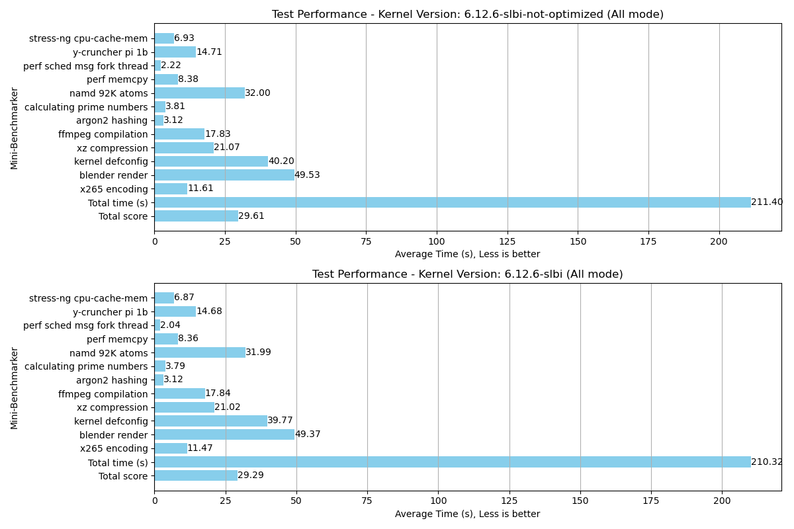

# Mini Benchmark Scraper

Mini Benchmark Scraper is a Python script that automates the extraction, parsing, and visualization of benchmark data from Mini Benchmarker log files. It processes multiple log files, computes averages across different benchmark modes for each kernel version, and generates comparison bar charts embedded in an HTML page for easy analysis.


## Features

- Data Extraction: Reads and extracts key performance metrics from Mini Benchmarker log files.
- Parsing & Aggregation: Processes multiple log files to calculate average results across different modes.
- Visualization: Generates comparison bar charts using matplotlib.
- HTML Report: Creates an HTML page (test_performance.html) that embeds the charts for easy viewing.

## Requirements

- Python 3.x
- Dependencies:
  - `numpy`
  - `matplotlib`

## Usage

1. Place your Mini Benchmarker log files in the same directory as `benchmark_scraper.py`.
2. Run the script:

   ```bash
   python benchmark_scraper.py

3. Once the script has completed execution, open the generated HTML page (test_performance.html) in your web browser to view the results.

## Mini Benchmarker Repository

The Mini Benchmarker script used to generate the log files can be found at https://gitlab.com/torvic9/mini-benchmarker.

## Example output



